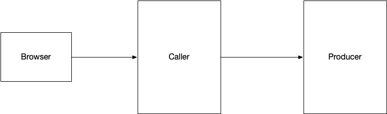

# Service to Service Call Demonstration

A sample demonstrating service to service call patterns in a variety of scenarios:

**


The "Producer" changes behavior based on the payload sent to it:
1. A configurable delay can be added to the response
2. A different response code can be added (say 5XX to simulate a server error)

## Running it locally

Start a service application using the following command:

```shell
./gradlew -p sample-producer bootRun
```

Start a client to the service:

```shell
./gradlew -p sample-caller bootRun
```

## Testing

A call to the Producer application:

```shell
curl -v -X "POST" "http://localhost:8080/producer/messages" \
     -H "Accept: application/json" \
     -H "Content-Type: application/json" \
     -d $'{
  "id": "1",
  "payload": "test",
  "delay": "1000",
  "responseCode": 200
}'
```

A call to the Caller, which in-turn dispatches to the Producer:

```shell
curl -X "POST" "http://localhost:8081/caller/messages" \
     -H "Accept: application/json" \
     -H "Content-Type: application/json" \
     -d $'{
  "id": "1",
  "payload": "test",
  "delay": "1000",
  "responseCode": 200
}'
```

A [UI](http://localhost:8081) is available at http://localhost:8081 to test out the flow locally
